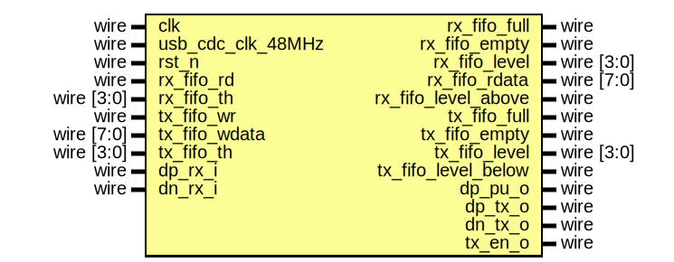

# EF_USB_CDC_WRAPPER

AHBL and APB bus wrappers with transmit and receive FIFOs for the verilog implementation of usb cdc in [ulixxe/usb_cdc](https://github.com/efabless/usb_cdc) repository
## The wrapped IP


 The IP comes with AHBL and APB Wrappers

#### Wrapped IP System Integration

```verilog
EF_USB_CDC_WRAPPER_AHBL INST (
	.HCLK(HCLK),
	.HRESETn(HRESETn),
	.HSEL(HSEL),
	.HADDR(HADDR),
	.HTRANS(HTRANS),
	.HWDATA(HWDATA),
	.HWRITE(HWRITE),
	.HREADY(HREADY),
	.HREADYOUT(HREADYOUT),
	.HRDATA(HRDATA),
	.IRQ(IRQ),
	.dp_pu_o(dp_pu_o),
	.dp_rx_i(dp_rx_i),
	.dn_rx_i(dn_rx_i),
	.dp_tx_o(dp_tx_o),
	.dn_tx_o(dn_tx_o),
	.tx_en_o(tx_en_o)
);
```

### External IO interfaces
|IO name|Direction|Width|Description|
|---|---|---|---|
|dp_pu_o|output|1|1.5kΩ D+ pullup enable|
|dp_rx_i|input|1|D+ input bit stream|
|dn_rx_i|input|1|D- input bit stream|
|dp_tx_o|output|1|D+ output bit stream|
|dn_tx_o|output|1|D- output bit stream|
|tx_en_o|output|1|D+/D- output enable|
### Interrupt Request Line (irq)
This IP generates interrupts on specific events, which are described in the [Interrupt Flags](#interrupt-flags) section bellow. The IRQ port should be connected to the system interrupt controller.

## The Programmer's Interface


### Registers

|Name|Offset|Reset Value|Access Mode|Description|
|---|---|---|---|---|
|TXDATA|0000|0x00000000|w|TX Data register; ; the interface to the Receive FIFO.|
|RXDATA|0004|0x00000000|r|RX Data register; the interface to the Receive FIFO.|
|TXFIFOLEVEL|0008|0x00000000|r|TX_FIFO Level Register.|
|RXFIFOLEVEL|000c|0x00000000|r|RX_FIFO Level Register.|
|TXFIFOT|0010|0x00000000|w|TX_FIFO Level Threshold Register.|
|RXFIFOT|0014|0x00000000|w|RX_FIFO Level Threshold Register.|
|IM|ff00|0x00000000|w|Interrupt Mask Register; write 1/0 to enable/disable interrupts; check the interrupt flags table for more details|
|RIS|ff08|0x00000000|w|Raw Interrupt Status; reflects the current interrupts status;check the interrupt flags table for more details|
|MIS|ff04|0x00000000|w|Masked Interrupt Status; On a read, this register gives the current masked status value of the corresponding interrupt. A write has no effect; check the interrupt flags table for more details|
|IC|ff0c|0x00000000|w|Interrupt Clear Register; On a write of 1, the corresponding interrupt (both raw interrupt and masked interrupt, if enabled) is cleared; check the interrupt flags table for more details|

### TXDATA Register [Offset: 0x0, mode: w]

TX Data register; ; the interface to the Receive FIFO.


### RXDATA Register [Offset: 0x4, mode: r]

RX Data register; the interface to the Receive FIFO.


### TXFIFOLEVEL Register [Offset: 0x8, mode: r]

TX_FIFO Level Register.


### RXFIFOLEVEL Register [Offset: 0xc, mode: r]

RX_FIFO Level Register.


### TXFIFOT Register [Offset: 0x10, mode: w]

TX_FIFO Level Threshold Register.


### RXFIFOT Register [Offset: 0x14, mode: w]

RX_FIFO Level Threshold Register.


### Interrupt Flags

The wrapped IP provides four registers to deal with interrupts: IM, RIS, MIS and IC. These registers exist for all wrapper types.

Each register has a group of bits for the interrupt sources/flags.
- `IM` [offset: ``0xff00``]: is used to enable/disable interrupt sources.

- `RIS` [offset: ``0xff08``]: has the current interrupt status (interrupt flags) whether they are enabled or disabled.

- `MIS` [offset: ``0xff04``]: is the result of masking (ANDing) RIS by IM.

- `IC` [offset: ``0xff0c``]: is used to clear an interrupt flag.


The following are the bit definitions for the interrupt registers:

|Bit|Flag|Width|Description|
|---|---|---|---|
|0|TXE|1|Transmit FIFO is Empty.|
|1|TXB|1|Transmit FIFO level is Below Threshold.|
|2|RXF|1|Receive FIFO is Full.|
|3|RXA|1|Receive FIFO level is Above Threshold.|
|4|RXE|1|Receive FIFO is Empty.|
|5|TXF|1|Transmit FIFO is Full.|

## Firmware Drivers:
Firmware drivers for EF_USB_CDC_WRAPPER can be found in the [Drivers](https://github.com/efabless/EFIS/tree/main/Drivers) directory in the [EFIS](https://github.com/efabless/EFIS) (Efabless Firmware Interface Standard) repo. EF_USB_CDC_WRAPPER driver documentation  is available [here](https://github.com/efabless/EFIS/blob/main/Drivers/docs/EF_Driver_USB_CDC_WRAPPER/README.md).
You can also find an example C application using the EF_USB_CDC_WRAPPER drivers [here](https://github.com/efabless/EFIS/tree/main/Drivers/docs/EF_Driver_USB_CDC_WRAPPER/example).
## Installation:
You can install the IP either by cloning this repository or by using [IPM](https://github.com/efabless/IPM).
### 1. Using [IPM](https://github.com/efabless/IPM):
- [Optional] If you do not have IPM installed, follow the installation guide [here](https://github.com/efabless/IPM/blob/main/README.md)
- After installing IPM, execute the following command ```ipm install EF_USB_CDC_WRAPPER```.
> **Note:** This method is recommended as it automatically installs [EF_IP_UTIL](https://github.com/efabless/EF_IP_UTIL.git) as a dependency.
### 2. Cloning this repo: 
- Clone [EF_IP_UTIL](https://github.com/efabless/EF_IP_UTIL.git) repository, which includes the required modules from the common modules library, [ef_util_lib.v](https://github.com/efabless/EF_IP_UTIL/blob/main/hdl/ef_util_lib.v).
```git clone https://github.com/efabless/EF_IP_UTIL.git```
- Clone the IP repository
```git clone https://github.com/efabless/EF_USB_CDC_WRAPPER```

### The Wrapped IP Interface 

>**_NOTE:_** This section is intended for advanced users who wish to gain more information about the interface of the wrapped IP, in case they want to create their own wrappers.



#### Ports 

|Port|Direction|Width|Description|
|---|---|---|---|
|dp_pu_o|output|1|1.5kΩ D+ pullup enable|
|dp_rx_i|input|1|D+ input bit stream|
|dn_rx_i|input|1|D- input bit stream|
|dp_tx_o|output|1|D+ output bit stream|
|dn_tx_o|output|1|D- output bit stream|
|tx_en_o|output|1|D+/D- output enable|
|rx_fifo_rd|input|1|Read from RX FIFO signal|
|rx_fifo_full|output|1|RX full flag|
|rx_fifo_empty|output|1|RX empty flag|
|rx_fifo_level|output|4|The current level of RX FIFO|
|rx_fifo_rdata|output|8|Received Data|
|rx_fifo_th|input|4|RX FIFO Threshold|
|rx_fifo_level_above|output|1|RX level above flag|
|tx_fifo_wr|input|1|Write to TX FIFO signal|
|tx_fifo_full|output|1|TX full flag|
|tx_fifo_empty|output|1|TX empty flag|
|tx_fifo_level|output|4|The current level of TX FIFO|
|tx_fifo_wdata|input|8|Transmitted Data|
|tx_fifo_th|input|4|TX FIFO Threshold|
|tx_fifo_level_below|output|1|TX level belows flag|